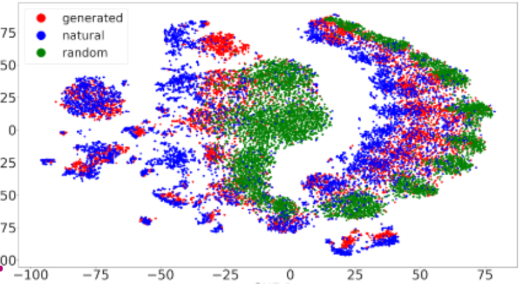

# ARN_Latent_diffusion_model
This Deep Learning course project, made by Alexandre Dessagne and Mathieu Dujardin aims to reproduce results from the article we chose: Latent Diffusion Models for Controllable RNA  Sequence Generation

Introduction
The aim of this study is to use generative AI to generate new non coding RNA sequences (ncRNA). ncRNA can be used in many ways to regulate protein expression in the human body. This can be applied to bolster the expression of tumor suppressor genes or inhibit the one of oncogenes (see poster 1st figure). 
The work is based on the [Ensembl genome dataset.](https://drive.google.com/file/d/1LjqV4Ma1Em48SecGBGjPtuKc0AJLpy7_/view?usp=sharing)
We limited each RNA categories to 1500 samples, making the whole database close to 10000 sequences.

The dataset shows a wide distribution of RNA sequence lengths, with a majority of shorter sequences. We chose to limit the length to 768 nucleotides per RNA, as done in the preprocessing step in the article, to ensure consistency across all entries. pendant quelques secondes
The dataset shows a wide range of sequence lengths, with a concentration of shorter sequences but also some longer ones. We limit the maximum length to 768 nucleotides per RNA, following the preprocessing steps described in the article.

Our aim is to generate plausible ncRNA sequences to learn about diffusion in a discrete setting.

Model Architecture
We used both models trained from scratch as well as pre-trained models. 

The architecture is adapted from Latent Diffusion Models for Controllable RNA Sequence Generation. 
Latent space
First a continuous latent space is created from the RNA sequences. The pre-trained BERT-like model RNA-FM is used to create one 640 sized token per nucleotide from all the sequences of the dataset.
The point of using a BERT-like model is to capture the meaning of each nucleotides but also the biological meaning of the context. The representation of G in GGCU will reflect not just the identity of G but also its structural and functional relationship with the neighboring nucleotides G, C, and U. Then a a querying transformer (encoder) and a causal transformer (decoder) are trained from scratch with a cross-entropy loss to get a fixed size 16*40 representation of each RNA sequence. We evaluate the latent space with a t-SNE representation figure 2. We can see that the latent space makes sense in the way that sequences are clustered by their types, especially the short (blue) versus long ones (purple).

Diffusion model
A classical diffusion DDPM model is trained from scratch on the latent space. The denoiser of the gaussian noise at each time space is a classical neural network. Thanks to the fixed-size and continuous latent space the diffusion is made possible without padding on discrete RNA sequences.

Evaluation
 By plotting t-sne1 and t-sne2 of the latent space we are able to see that the generated ncRNAs are closer to the real than to the random one as depicted in the source article. (random one are created this way : same distribution of lengths as the real sequences and uniform distributions over A,U,C,G) Random sequences are further away and do not overlap with existing sequences while diffusion generated sequences overlap as well as expand the distribution of ncRNAs.

Lesson learnt and ways to expand the work

This project enables us to do a deep dive in how RNA molecules are widely used inside the human body, their relevance for cancer treatment and the fact that they are being studied from an AI point of view. This project taught us the pytorch library for our first transformer implementation as well as using pre-trained models. However in order to better test the work, another way of training the decoder should have helped us gain more insights on the produced sequences. Indeed our decoder worked fine for creating the latent space but did not have satisfying performance for decoding latent vectors in an autoregressive way, perhaps because of the dataset size.

